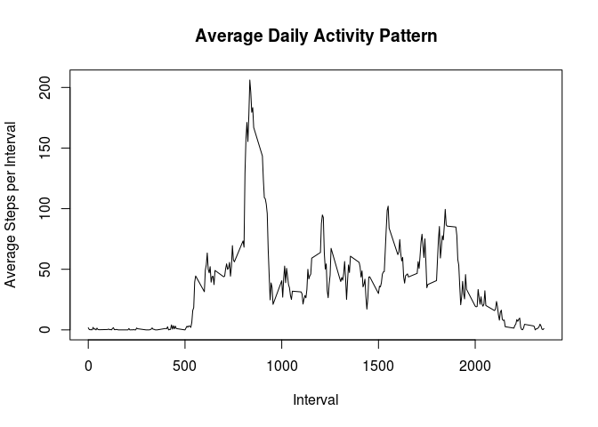

# Reproducible Research: Peer Assessment 1


## Loading and preprocessing the data

Read in the zip file

```r
# Assume the data is in current working directory in a file named "activity.zip" 
activityData <- read.csv(unz("activity.zip", "activity.csv"))
```

Clean up and extend our data

```r
# the interval seems to be in 24 hour time 00:00 -> 23:55
# Add and extra column "time" that will convert date and interval into a
# POXIXct object for later data calulations
activityData$date <- as.Date(strptime(sprintf("%s %04d", 
                                      activityData$date, 
                                      activityData$interval), 
                              format = "%F %H%M", 
                              tz = "GMT")) 
```

## What is mean total number of steps taken per day?

```r
stepsPerDay<-tapply(activityData$steps,activityData$date,FUN=sum)
hist(stepsPerDay,breaks=20, main="Steps per Day",xlab="steps")
```

 


```r
# Remove the NAs while calculating the mean and median
stepsMM <- c(mean(stepsPerDay,na.rm=TRUE),median(stepsPerDay,na.rm=TRUE))
stepsMM <- setNames (stepsMM,c("Mean","Median"))
stepsMM
```

```
##     Mean   Median 
## 10766.19 10765.00
```


## What is the average daily activity pattern?

Average steps per interval

```r
# Calulate our averages over intervals ignoring NAs
avgDailyActivity <- data.frame(tapply( activityData$steps,
                                       activityData$interval,
                                       FUN=mean,
                                       na.rm=TRUE ))
avgDailyActivity$interval <-levels(as.factor( activityData$interval))
colnames(avgDailyActivity) <-c("Average.Steps","Interval")
with (avgDailyActivity, plot ( Average.Steps ~ Interval, 
                               type="l", 
                               main= "Average Daily Activity Pattern", 
                               xlab= "Interval",
                               ylab = "Average Steps per Interval")
)
```

 

Interval with the maximum number of steps (on average)

```r
print (avgDailyActivity[which.max(avgDailyActivity$Average.Steps),],row.names=FALSE)
```

```
##  Average.Steps Interval
##       206.1698      835
```

## Imputing missing values

Find the number of NAs

```r
sum(is.na(activityData$steps))
```

```
## [1] 2304
```

Imput the values for the NAs

```r
# Copy the activity to a new data.frame object
# The NAs will be replaced with the mean value of the all the other 
# step measurements within the same interval
newActivityData <- activityData
newActivityData[is.na(newActivityData$steps),]$steps <- 
  round(tapply(X=newActivityData$steps,
               INDEX=newActivityData$interval,
               FUN=mean,
               na.rm=TRUE))
```

Create a histogram of the the new data calculate the mean and median

```r
# sum up the total steps per day based on the the new data.frame 
# with the imputed steps per interval calaulated in the previous step
newStepsPerDay<-tapply(newActivityData$steps,newActivityData$date,FUN=sum)
hist(newStepsPerDay,breaks=20, main="Steps per Day",xlab="steps")
```

 


```r
# Calculate the mean and median (all NAs have been imputed)
newStepsMM <- c(mean(newStepsPerDay),median(newStepsPerDay))
newStepsMM <- setNames (newStepsMM,c("Mean","Median"))
newStepsMM
```

```
##     Mean   Median 
## 10765.64 10762.00
```
## Are there differences in activity patterns between weekdays and weekends?

Create a weekday/weekend factor

```r
dow <- function (x) { 
  day<-weekdays(x)
  if (day=="Saturday"|| day=="Sunday") {
    return("weekend") 
  } else {
      return("weekday")
  }
}
activityData$daytype <- sapply(activityData$date,FUN=dow)
```

Average number of steps taken, averaged across all weekday days or weekend days

```r
# Calculate averages (means) by factor
stepsByDaytype<- data.frame(tapply( activityData$steps, INDEX = list(activityData$interval, activityData$daytype),FUN=mean,na.rm=TRUE ))
# Some data.frame clean up to make things plot correctly
stepsByDaytype <- cbind(interval =rownames(stepsByDaytype), stepsByDaytype)
stepsByDaytype$interval <- as.character(stepsByDaytype$interval)
par(mfrow=c(2,1), mar=c(2,5,1,1))
with (stepsByDaytype, plot ( weekend ~ interval, type="l", main="weekend", xlab="", ylab="steps"))
with (stepsByDaytype, plot ( weekday ~ interval, type="l", main="weekday", xlab ="interval", ylab="steps"))
```

 

