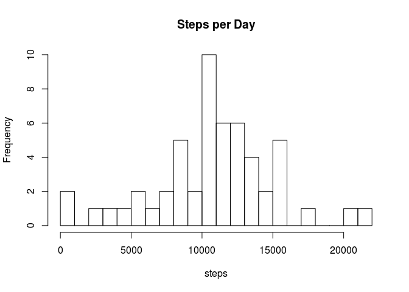

# Reproducible Research: Peer Assessment 1


## Loading and preprocessing the data

Read in the zip file

```r
# Assume the data is in current working directory in a file named "activity.zip" 
activityData <- read.csv(unz("activity.zip", "activity.csv"))
```

Clean up and extend our data

```r
# the interval seems to be in 24 hour time 00:00 -> 23:55
# Add and extra column "time" that will convert date and interval into a
# POXIXct object for later data calulations
activityData$time <- strptime(sprintf("%s %04d", 
                                      activityData$date, 
                                      activityData$interval), 
                              format = "%F %H%M", 
                              tz = "GMT")
```

## What is mean total number of steps taken per day?

```r
stepsPerDay<-tapply(activityData$steps,activityData$date,FUN=sum)
hist(stepsPerDay,breaks=10, main="Steps per Day",xlab="steps")
```

 


```r
# Remove the NAs while calculating the mean and median
stepsMM <- c(mean(stepsPerDay,na.rm=TRUE),median(stepsPerDay,na.rm=TRUE))
stepsMM <- setNames (stepsMM,c("Mean","Median"))
stepsMM
```

```
##     Mean   Median 
## 10766.19 10765.00
```


## What is the average daily activity pattern?

Average steps per interval

```r
# Calulate our averages over intervals ignoring NAs
avgDailyActivity <- tapply( activityData$steps,
                            activityData$interval,
                            FUN=mean,
                            na.rm=TRUE )
# Tidy our row names to make the plot easier to read 
# Intervals should look like 24hr time: 00:00 thru 23:55
rownames(avgDailyActivity) <- sub('(?<=.{2})', 
                                  ':', 
                                  sprintf("%04d",as.integer(rownames(avgDailyActivity))), 
                                  perl=TRUE)
# Convert to a data frame for plotting
temp <- data.frame(interval=rownames(avgDailyActivity),average=avgDailyActivity)
plot(temp, 
     type="l", 
     main="Average Daily Activity Pattern", 
     xlab ="Interval", 
     ylab="Average Steps per Interval")
```

 

Interval with the maximum number of steps (on average)

```r
print (temp[which.max(temp$average),],row.names=FALSE)
```

```
##  interval  average
##     08:35 206.1698
```

## Imputing missing values

Test of project intergration at work 

## Are there differences in activity patterns between weekdays and weekends?
